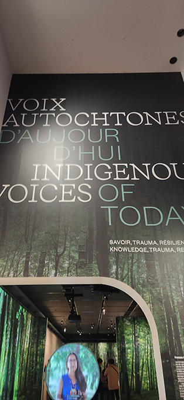
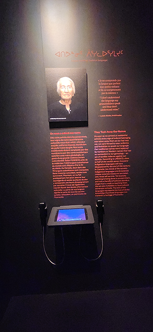
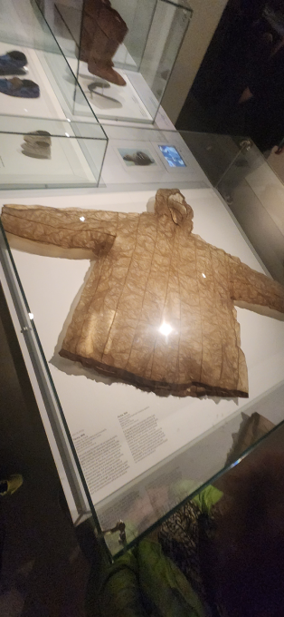
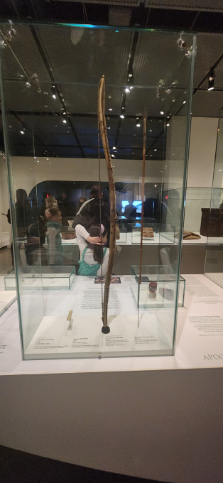
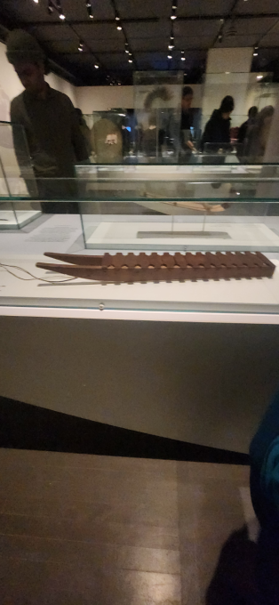

Voivi le nom de l'exposition

Le dispositif multimédia principalement utilisé dans l'exposition est un écran avec deux téléphones aui permettent d'entendre ce qui est dit à l'écran

Voici le style de manteau que les Autochtones portaient à l'époque

Voici le genre d'arme que les Autochtones utilisaient

